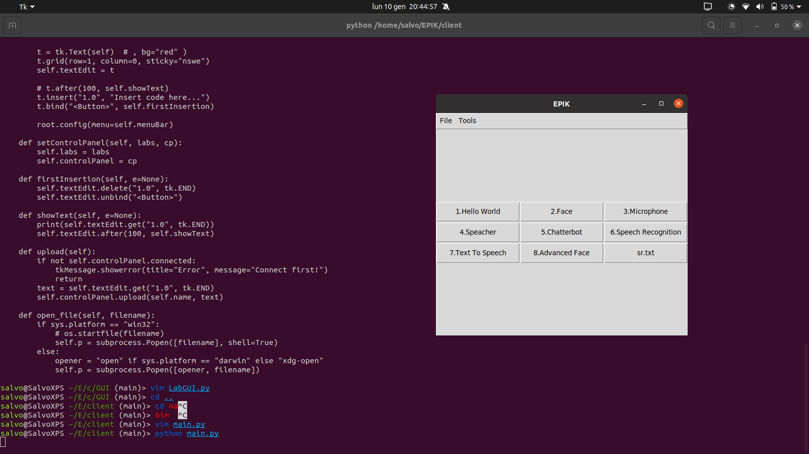
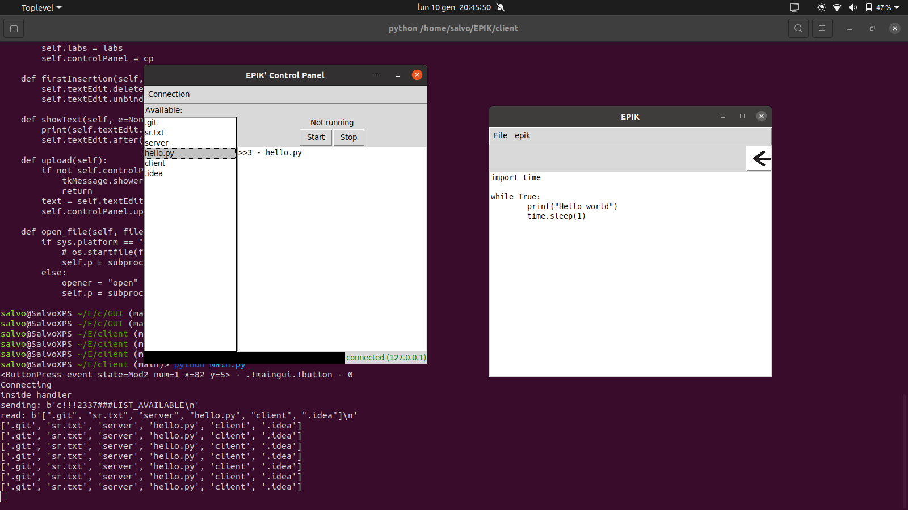

# EPIK
E.P.I.K., the Education Programmable Improving Kit.

# Dependences
The software is written in python (version 3). It is necessary to install the following packages:
- asyncio
- netifaces 
- subprocess
- tkinter
- json
- os
- threading
- time


# Usage
The software is split in two parts.

1. The server side goes directly on the Raspberry Pi. To start the software simply go to the server directory and type:
```python
python3 ERIS.py
```
> Note: ERIS is the old name, recently replaced by EPIK.

2. The client side goes on the laboratory computer. To start that server it's possibile to type:
```python
python3 main.py
```

# How the students use it
The server runs on the Raspberry Pi. At first it just displays its own ip address which will be used by the students to connect the client to the server.
The client software runs on the laboraty computers and it shows all the available activites in the main interface. The available activities correspond to simple documents (pdf preferred) which are placed in the directory client/pdf. We uploaded a single exmaple called "Amp_ADC.pdf" (all the other files are just placeholders).
As the user clicks on the activity, the document will be opened and it contains all the useful information needed to complete the activity. The interface will swap to a simple text editor in which the student can write his code.


- Under "epik > EPIK control panel..." in the context menu it is possibile to manage EPIK. The new window displays the activities previously uploaded on EPIK and can be run or stopped. 
> Note: at the moment of writing this document, the start and stop features don't work properly and have to be refined. 
- In the control panel interface, it is possibile to connect EPIK using the menu "Conection > connect..."
- Under "epik > upload" it is possibile to upload the written code, although it is necessary to connect EPIK beforehand.


